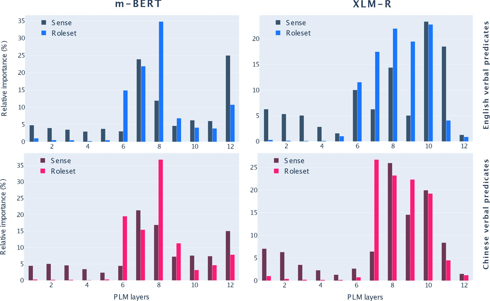

<div align="center">    
 
# Probing Pretrained Language Models for Predicate Argument Structures

[]()
[](https://www.2022.aclweb.org/)
[](https://creativecommons.org/licenses/by-nc/4.0/)

</div>

## Cite this work
If you use any part of this work, please consider citing the paper as follows:

```
@inproceedings{conia-navigli-2022-probing,
    title      = "Probing Pretrained Language Models for Predicate Argument Structures",
    author     = "Conia, Simone and Navigli, Roberto",
    booktitle  = "Proceedings of the 60th Annual Meeting of the Association for Computational Linguistics (ACL 2022)",
    month      = may,
    year       = "2022",
    address    = "Dublin, Ireland",
    publisher  = "Association for Computational Linguistics"
}
```

## Description
This is the repository for the paper [*Probing Pretrained Language Models for Predicate Argument Structures*](),
to be presented at ACL 2022 by [Simone Conia](https://c-simone.github.io) and [Roberto Navigli](http://wwwusers.di.uniroma1.it/~navigli/).


## Abstract
> Thanks to the effectiveness and wide availability of modern pretrained language models
  (PLMs), recently proposed approaches have achieved remarkable results in dependency-
  and span-based, multilingual and cross-lingual Semantic Role Labeling (SRL). These results
  have prompted researchers to investigate the inner workings of modern PLMs with the aim
  of understanding how, where, and to what extent they encode information about SRL. In
  this paper, we follow this line of research and probe for predicate argument structures
  in PLMs. Our study shows that PLMs do encode semantic structures directly into the
  contextualized representation of a predicate, and also provides insights into the correlation
  between predicate senses and their structures, the degree of transferability between nominal and
  verbal structures, and how such structures are encoded across languages. Finally, we look at
  the practical implications of such insights and demonstrate the benefits of embedding
  predicate argument structure information into an SRL model.




## Download
You can download a copy of all the files in this repository by cloning the
[git](https://git-scm.com/) repository:

    git clone https://github.com/SapienzaNLP/srl-pas-probing.git

or [download a zip archive](https://github.com/SapienzaNLP/srl-pas-probing/archive/main.zip).

### Checkpoints
* Coming soon

## How to run
You'll need a working Python environment to run the code.
The recommended way to set up your environment is through the
[Anaconda Python distribution](https://www.anaconda.com/download/) which
provides the `conda` package manager.
Anaconda can be installed in your user directory and does not interfere with
the system Python installation.

We use `conda` virtual environments to manage the project dependencies in
isolation.
Thus, you can install our dependencies without causing conflicts with your
setup (even with different Python versions).

Run the following command and follow the steps to create a separate environment:

    > ./setup.sh
    > Enter environment name (recommended: srl-pas-probing): srl-pas-probing
    > Enter python version (recommended: 3.8): 3.8
    > Enter cuda version (e.g. '10.2' or 'none' to avoid installing cuda support): 10.2

### Get the data
We use the dataset provided as part of the CoNLL-2009 shared task:
* [Hajic et al., 2009. The CoNLL-2009 Shared Task: Syntactic and Semantic Dependencies in Multiple Languages](https://aclanthology.org/W09-1201/).
The dataset is available through LDC ([LDC2012T04](https://catalog.ldc.upenn.edu/LDC2012T04)).

Once you have downloaded and unzipped the data, place it in `data/txt` as follows:
```
data
├── txt
│   ├── en
│   │   ├── CoNLL2009_dev.txt
│   │   ├── CoNLL2009_test_ood.txt
│   │   ├── CoNLL2009_test.txt
│   │   └── CoNLL2009_train.txt
│   └── zh
│       ├── CoNLL2009_dev.txt
│       ├── CoNLL2009_test.txt
│       └── CoNLL2009_train.txt
```

**Note:** Make sure that the datasets are renamed as specified in the example above.
If you have your own datasets or the same datasets using a different name, check
the `scripts/preprocess/preprocess_conll_2009.sh` script and modify it accordingly.

### Data preprocessing
To preprocess the datasets, simply run the script `preprocess_conll_2009.sh` from the root directory of the project:
```
./scripts/preprocess/preprocess_conll_2009.sh
```

After running the script, you will find the preprocessed datasets in `data/json/` as follows:
```
data/
├── json
│   ├── en
│   │   ├── CoNLL2009_dev.json
│   │   ├── CoNLL2009_dev.nouns.json
│   │   ├── CoNLL2009_dev.verbs.core.json
│   │   ├── CoNLL2009_dev.verbs.json
│   │   ├── CoNLL2009_test.json
│   │   ├── CoNLL2009_test.nouns.json
│   │   ├── CoNLL2009_test_ood.json
│   │   ├── CoNLL2009_test_ood.nouns.json
│   │   ├── CoNLL2009_test_ood.verbs.json
│   │   ├── ...
```

### Train a probe
You can train a probing model from scratch using the following command:
```bash
# Language model: RoBERTa-base
# Trained on: verbal predicates
# Activation function: identity
# Probe type: weighted average
python train_on_roleset_classification.py \
    --train_path data/json/en/CoNLL2009_train.verbs.json \
    --dev_path data/json/en/CoNLL2009_dev.verbs.json \
    --test_path data/json/en/CoNLL2009_test.verbs.json \
    --language_model_name roberta-base \
    --batch_size 32 \
    --max_epochs 20 \
    --language_model_type mixed_bert_embeddings \
    --word_encoding_activation identity \
    --inventory propbank
```

where `--language_model` indicates the name of the underlying language model to use.
The model should support many BERT-based models from the Huggingface's Transformers library.
We experimented with `bert-base-cased`, `bert-large-cased`, `roberta-base`, `roberta-large`,
`bert-base-multilingual-cased`, `xlm-roberta-base`.

If you want to train a probe on a different dataset or a different split, e.g., nominal predicates,
you can specify a different path with `--train_path`, `--dev_path` and `--test_path`:
```bash
# Language model: RoBERTa-base
# Trained on: nominal predicates
# Activation function: identity
# Probe type: weighted average
python train_on_roleset_classification.py \
    --train_path data/json/en/CoNLL2009_train.nouns.json \
    --dev_path data/json/en/CoNLL2009_dev.nouns.json \
    --test_path data/json/en/CoNLL2009_test.nouns.json \
    --language_model_name roberta-base \
    --batch_size 32 \
    --max_epochs 20 \
    --language_model_type mixed_bert_embeddings \
    --word_encoding_activation identity \
    --inventory propbank
```

#### Train all the probes
You can also train multiple probes (sequentially, one just after the other) with a single command:
```bash
# Train probes that concatenate the top-4 layers of a language model
./scripts/training/train_propbank_concat_probes.sh
```

### Evaluate a probe
You can evaluate a trained probe on a dataset using the following command:
```
python evaluate_on_roleset_classification.py \
    --inventory propbank \
    --datamodule logs_probing/propbank/bert_verbs_identity/config.json \
    --checkpoint logs_probing/propbank/bert_verbs_identity/checkpoints/msrl*.ckpt \
    --test_path data/json/CoNLL2009_test.verbs.json \
    --output output/roleset_predictions/propbank/bert_verbs_identity.txt
```

The command loads a checkpoint (and its configuration `config.json`), runs the model to obtain the predictions on the instances contained
in `data/json/CoNLL2009_test.verbs.json` and writes the predictions in `output/roleset_predictions/propbank/bert_verbs_identity.txt`.

The output is in a human-readable format and looks like this:
```
3	The 49 stock specialist firms on the Big Board floor -- the buyers and sellers of last resort who were criticized after the 1987 crash -- once again could n't handle the selling pressure .
Pred:	criticize-v.01	A0	A1	AM-TMP
Gold:	criticize-v.01	A1	AM-TMP
Pred:	handle-v.01	A0	A1	AM-MOD	AM-NEG
Gold:	handle-v.01	A0	A1	AM-MOD	AM-NEG	AM-TMP
```

In the example above, the probe predicted an additional argument (`A0`) for the predicate `criticize-v.01`.
It also missed an argument (`AM-TMP`) for the predicate `handle-v.01`.

#### Evaluate all probes
You can also evaluate multiple probes with a single command:
```bash
# Evaluate probes that concatenate the top-4 layers of a language model
./scripts/evaluation/evaluate_propbank_concat_probes.sh
```

## License
This work is under the Attribution-NonCommercial 4.0 International (CC BY-NC 4.0) license.
